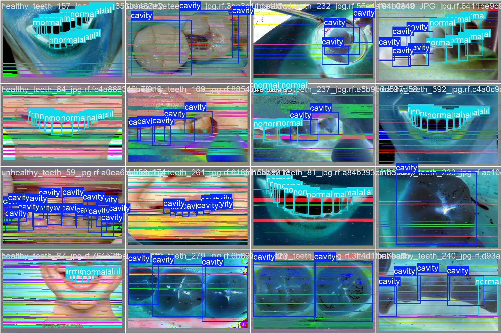
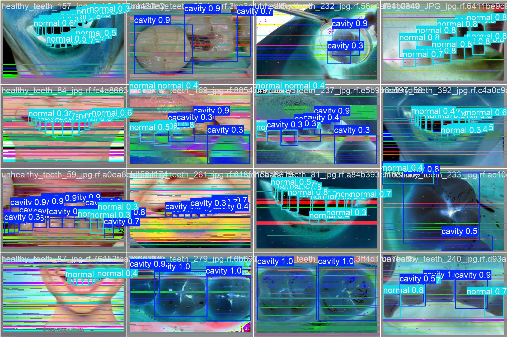

# DentVision
## YOLO-Based Automated Detection of Dental Cavities in Intraoral Images


DentVision is a deep learning research project for **automated detection of dental cavities in intraoral images** using YOLO-based object detection models.  
This repository presents the complete workflow of **dataset preparation, label conversion, model training, evaluation, and result visualization** for computer-aided dental diagnosis.

---
## Contributors
- Weihao Cheng (2024 Grade), School of Communication Engineering / School of Computer Science and Technology, Hangzhou Dianzi University
- Hangyu Zhu (2024 Grade), School of Communication Engineering, Hangzhou Dianzi University

## Collaboration
We welcome collaboration opportunities! For inquiries, please contact: weihao_cheng@hdu.edu.cn

---
## Overview

Dental caries remain one of the most prevalent oral diseases worldwide and are closely associated with oral pain, infection, and reduced quality of life. Early identification of suspicious carious regions is clinically important, yet manual examination from images is time-consuming and depends heavily on professional expertise.

To explore the feasibility of AI-assisted dental diagnosis, DentVision evaluates multiple YOLO-based object detection models for automated cavity detection in intraoral photographs. The project focuses on a lightweight and reproducible workflow that can be further extended for intelligent oral screening applications.

---
## Overview
## Detection Visualization

Below is a comparison between the **ground truth annotations** and the **model predictions** on the validation set.

### Ground Truth Labels

<p align="center">

</p>

### Model Predictions

<p align="center">

</p>
---
#Project Highlights

- Automated detection of **dental cavities** from intraoral images
- Comparative evaluation of **YOLOv5s, YOLOv8n, and YOLOv8s**
- Annotation conversion from **oriented bounding box format** to standard YOLO format
- Quantitative evaluation using **Precision, Recall, mAP@0.5, and mAP@0.5:0.95**
- Visualization of training curves, confusion matrix, PR curve, and detection examples
- Reproducible research workflow for dental AI studies

---

## Project Structure

```text
DentVision/
├── .gitignore
├── LICENSE
├── README.md
├── README.dataset.txt
├── README.roboflow.txt
├── convert_labels.py
├── data.yaml
├── assets/
│   ├── pipeline.png
│   ├── results_yolov5s.png
│   ├── results_yolov8n.png
│   ├── results_yolov8s.png
│   ├── pr_curve.png
│   ├── confusion_matrix.png
│   ├── pred1.jpg
│   ├── pred2.jpg
│   └── pred3.jpg
